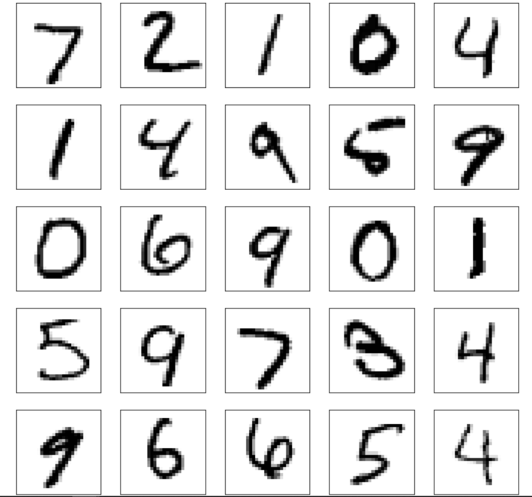

# Hand-Written-Digits-identificaton-with-Tensorflow

<h2>Introduction</h2>

This image describes the problem that we are trying to solve visually. We want to create and train a model that takes an image of a hand written digit as input and predicts the class of that digit, that is, it predicts the digit or it predicts the class of the input image.
 
 
<h2>Dataset</h2>

Here we are using the MNIST dataset in TensorFlow package
   which has:
  <ul>
    <li> 60000, 28X28 pixels Training Images</li>
    <li> 10000, 28X28 pixels Testing Images</li>
  </ul>  
   
  <h2>Some Examples from the Dataset</h2>
   
 
<h2>Data Encoding and Normalizing</h2>

For encoding the data we use the labels corresponding to data and perform <b>One Hot-Encoding</b> on it.
 After this encoding, every label will be converted to a list with 10 elements and the element at index to the corresponding class will be set to 1, rest will be set to 0:

| original label | one-hot encoded label |
|------|------|
| 5 | [0, 0, 0, 0, 0, 1, 0, 0, 0, 0] |
| 7 | [0, 0, 0, 0, 0, 0, 0, 1, 0, 0] |
| 1 | [0, 1, 0, 0, 0, 0, 0, 0, 0, 0] |

 We Normalize the data with the Mean and Standard Deviation of the data set 
by formula: (X-X_mean) / (X_standard Devation)

<h2>Creating the Model Using Neural Network from TensorFlow</h2>
 
<h3>Linear Equations</h3>
 

The above graph simply represents the equation:

<b>y = w1 * x1 + w2 * x2 + w3 * x3 + b</b>

Where the `w1, w2, w3` are called the weights and `b` is an intercept term called bias. The equation can also be *vectorised* like this:

<b>y = W . X + b</b>

Where `X = [x1, x2, x3]` and `W = [w1, w2, w3].T`. The .T means *transpose*. This is because we want the dot product to give us the result we want i.e. `w1 * x1 + w2 * x2 + w3 * x3`. This gives us the vectorised version of our linear equation.

 

<h3>Neural Networks</h3>

 

Here we use Sequential model in Keras in TensorFlow Package with 2 hidden Dense layers with "relu" activation and output is also a Dense Layer with "softmax" activation 
This model is much more likely to solve the problem as it can learn more complex function mapping for the inputs and outputs in our dataset.

<h2>Results</h2>
 
After Training and Testing the Model 
Total accuracy was around <b>96.36%</b>
