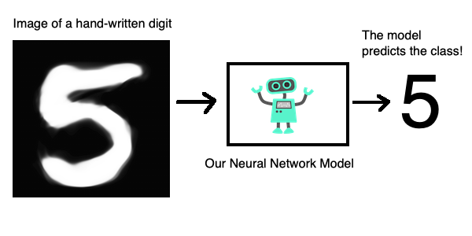

# Hand-Written-Digits-identificaton-with-Tensorflow

<h2>Introduction</h2>

This image describes the problem that we are trying to solve visually. We want to create and train a model that takes an image of a hand written digit as input and predicts the class of that digit, that is, it predicts the digit or it predicts the class of the input image.
 
 
<h2>Dataset</h2>

Here we are using the MNIST dataset in TensorFlow package
   which has:
  <ul>
    <li> 60000, 28X28 pixels Training Images</li>
    <li> 10000, 28X28 pixels Testing Images</li>
  </ul>  
